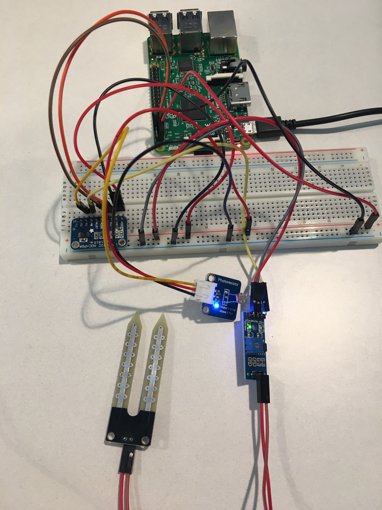

# Humidity and Light Sensor App

Project is built primarily from the [Azure IoT Hub Sample for Python](https://github.com/Azure-Samples/iot-hub-python-raspberrypi-client-app) and was modified to use the [Adafruit ADS1015](https://www.adafruit.com/product/1083) ADC (analog to digital cnverter) with external sensors connected to it instead of the Adafruit BME280 temperature and humidity sensor.

The code assumes you have your own soil humidity sensor and photoresitor light sensor connected to the ADC 0 and 1 channels respectively. A sample setup is shown below.



## Setup Instructions

Clone this project onto your RaspberryPi and install the Azure IoT SDK for Python using the `setup.sh` script. From the terminal on your pi run the following commands.

```terminal 
cd ./iot-hub-python-raspberrypi-client-app
sudo chmod u+x setup.sh
sudo ./setup.sh
```

> Note: These setup instructions are taken from the [Azure IoT Hub Sample for Python](https://github.com/Azure-Samples/iot-hub-python-raspberrypi-client-app). That repo has more information about potential issues during the installation.

## Running Instructions

To run this app you need to provide your Azure IoT Hub device connection string as an environment variable as shown in the terminal command below.

```terminal
sudo python app.py '<Azure IoT Hub device connection string>'
```

> Note: Your connection string must be in quotes to be recognized properly.